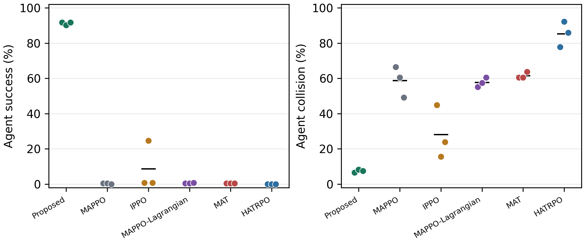
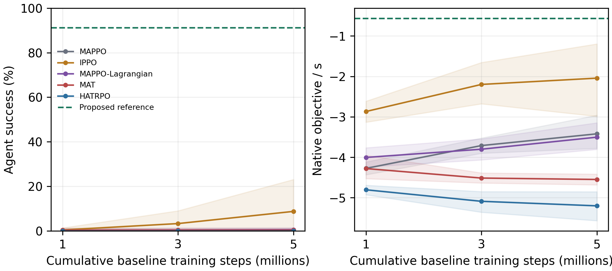

# Liveness-Aware Obstacle-Waypoint Coordination With Bounded Neural Control

Final reproducibility release for **Liveness-Aware Obstacle-Waypoint Coordination With Bounded Neural Control for Multi-Agent Aerial Navigation**.

[Public repository](https://github.com/shaun19920309/Success-Aware-Risk-Budgeted-Graph-Conditioned-Arbitration-for-Safe-Multi-Agent-Aerial-Navigation)

Deployment uses synchronized stage-enter-egress targets, inflated-grid A* waypoints, waypoint-conditioned observations, and **one bounded BC motor controller**. It is not an ensemble. DAgger is a component ablation only. Manuscript PDF/LaTeX are excluded.


## Primary Same-Waypoint 5M Comparison

All five baselines receive identical phase targets and A* waypoints, unified active-target/progress/arrival/collision rewards, and corrected hybrid Lagrangian cost where applicable. Training seeds are 260000/260001/260002. Fifteen runs produced 45 immutable 1M/3M/5M checkpoints, each evaluated on 32 paired layouts: **1440/1440 evaluations**. Every rollout has 701 frames, matching initial physical hashes, one policy, and no safety shield.

| Method | Success | Collision | Deadlock | Progress (m) | Objective/s | Risk <0.65 m |
|---|---:|---:|---:|---:|---:|---:|
| Proposed BC | 91.28% | 7.42% | 1.30% | 2.3595 | -0.5638 | 21.79% |
| MAPPO 5M | 0.26% | 58.72% | 41.02% | -1.3810 | -3.4208 | 8.81% |
| IPPO 5M | 8.72% | 28.12% | 63.15% | 0.5766 | -2.0436 | 31.73% |
| MAPPO-Lagrangian 5M | 0.52% | 57.68% | 41.80% | -1.4065 | -3.5037 | 12.25% |
| MAT 5M | 0.39% | 61.59% | 38.02% | -1.8634 | -4.5498 | 8.74% |
| HATRPO 5M | 0.00% | 85.29% | 14.71% | -1.5793 | -5.2023 | 29.95% |

All 25 primary 5M outcome comparisons pass favorable hierarchical 95% CI, Holm correction (adjusted p=0.000125 at the Monte Carlo resolution), and 9/9 model-pair direction gates. Success increases by **82.55--91.28 percentage points**, collision decreases by **20.70--77.86 points**. The 9 pairings reuse 3 training seeds per method, not 9 independent seeds.




## Essential Caveats

- IPPO success improves from 0.39% to 3.26% to 8.72% at 1M/3M/5M; its three 5M models achieve 0.78%, 24.61%, and 0.78%.
- Two distinct MAT checkpoints produce identical executed-action hash sequences with saturated actions in all 32 evaluations each. This diagnoses execution saturation, not duplicated weights; its optimization cause remains open.
- Raw risk is **not uniformly lower**: proposed exposure exceeds MAPPO/Lagrangian/MAT; IPPO exposure CIs cross zero. Favorable HATRPO exposure intervals are exploratory, outside the primary Holm family.
- Same high-level assistance does not equalize teacher supervision or design effort. BC uses 179,456 labels, not an equivalent RL interaction budget.
- September 3 recovery lacked optimizer/process RNG and on-policy ValueNorm state. September 8 MAT/HATRPO recovery restored those available states but not simulator episodes or rollout buffers. Budgets are cumulative, **not uninterrupted or bitwise-continuous**. Recovery manifests are included.
- Three training seeds, no hyperparameter sweep, and saturation limit claims about optimized RL. Neither convergence, formal safety, nor real-world transfer is established.
- Objective/s is recomputed from raw terminal objective with a common 7.0-second denominator. The September 9 audit corrected a legacy BC/baseline 7.0/7.01 reporting mismatch; raw CSVs and all non-objective metrics are unchanged.

## Supporting Evidence

Proposed-only success: 88.02% (four agents), 96.35% (sparse/small obstacles), 69.79% (dense/large obstacles). These are not shifted-scenario baseline comparisons. Component ablation supports waypoint/phase coordination and finds no verified outcome gain from DAgger.

The proposed stack's earlier isolated RTX 5090 profile is **9.020 ms/frame**. Baseline timing rows use earlier unadapted 1M policies, not the new same-waypoint 5M comparators.

## Reproduction

```bash
python reproduce/verify_package.py
PYTHON=python bash reproduce/reanalyze.sh
PYTHON=python bash reproduce/run_tests.sh
```

Reanalysis uses 100,000 hierarchical bootstrap draws, 200,000 conditional sign flips, and a 25-test 5M Holm family. The manifest is checked before recomputation and refreshed afterward. Compact seed rows suffice for statistics; large baseline weights and per-frame traces are omitted.

For full simulator regeneration see [EXPERIMENTS.md](docs/EXPERIMENTS.md), [environment](environment/ENVIRONMENT.md), and [external adapters](third_party_patches/README.md). Unpinned upstream sources and interruption history prevent a byte-identical fresh-training guarantee.

```bash
PYTHON=python TRAIN_DEVICE=cuda bash reproduce/train_final_bc.sh
OUT_ROOT="$PWD/results/regenerated_fair_waypoint_budget" PY=python \
  bash scripts/run_horizon7_fair_waypoint_budget_logged.sh ippo 260000
```

Repeat baseline training for five methods and three registered seeds, using a new output root.

## Layout

- `results/revision_horizon7_fair_waypoint_budget_20260901/`: primary raw rows, analysis, protocol, audits, recovery and training provenance.
- `results/final_formal_multiseed/`: proposed checkpoints/reference rows, generalization, earlier isolated runtime, and secondary unequal-hierarchy 1M diagnostics.
- `results/final_component_ablation/`: final-method component evidence.
- `data/training/`: exact BC train/validation arrays.
- `scripts/`, `third_party_patches/`: final controller, adapters, training, evaluation, statistics, tests, scientific figure generators.
- `docs/`, `environment/`, `reproduce/`, `manifests/`: interpretation, setup, commands, SHA-256 inventory.

Archived training metadata is stored under `training_provenance/`, not a runnable checkpoint tree, so a fresh launcher cannot mistake metadata for completed training.
