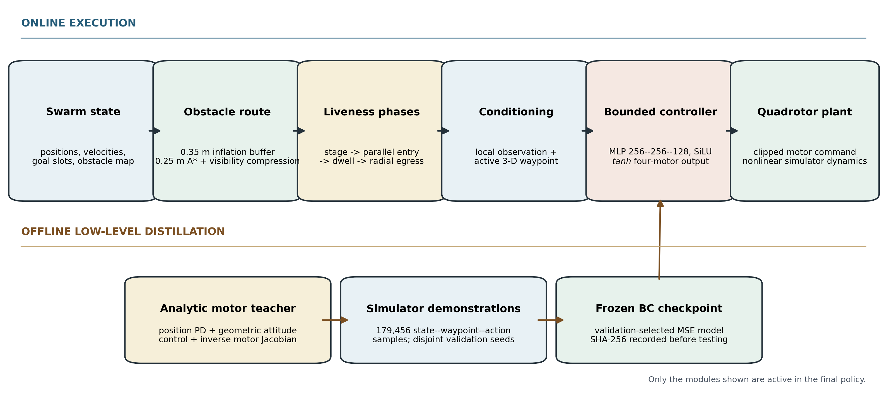
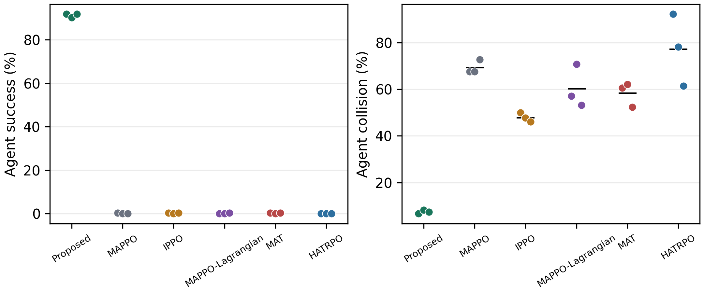
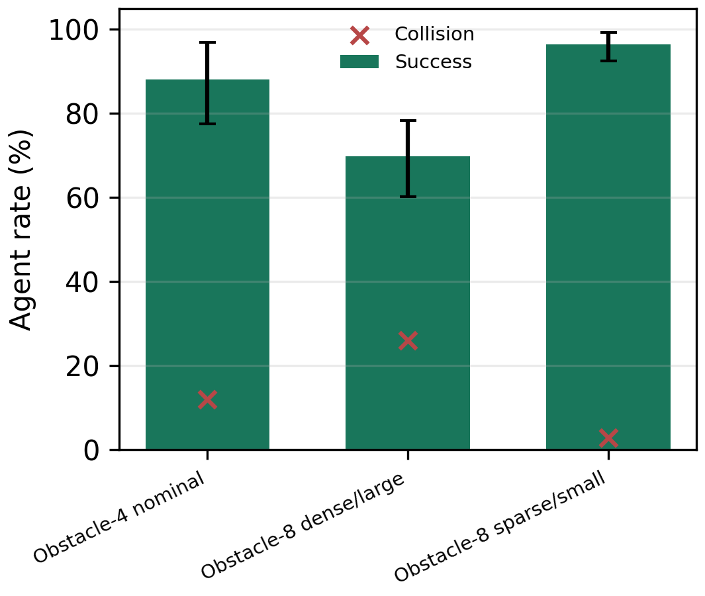
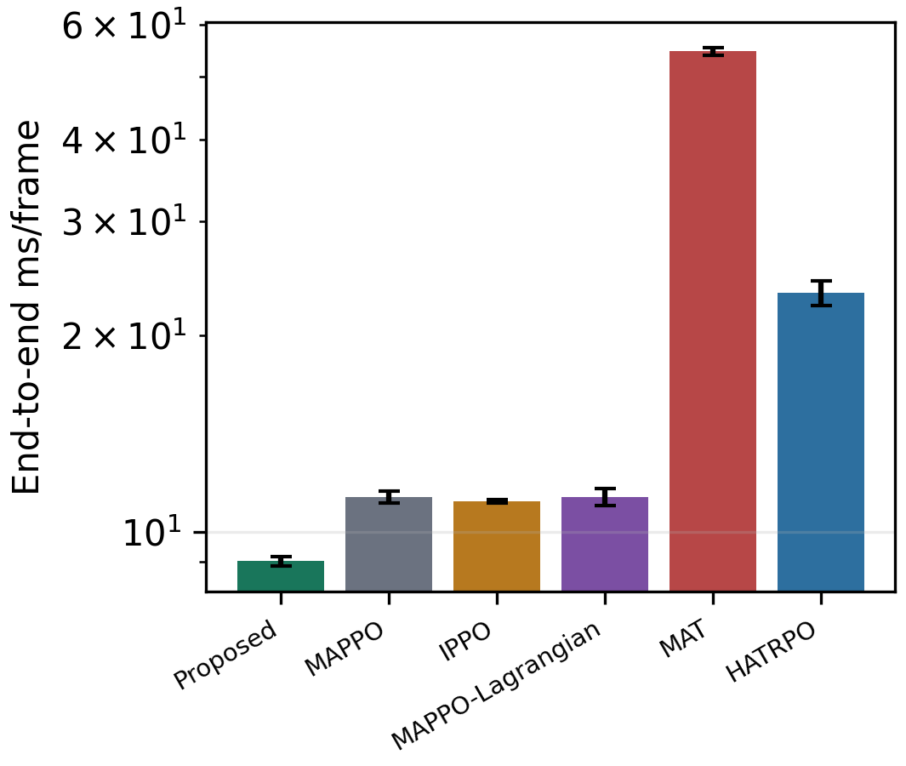

# Liveness-Aware Obstacle-Waypoint Coordination With Bounded Neural Control

Reproducibility package for **Liveness-Aware Obstacle-Waypoint Coordination With Bounded Neural Control for Multi-Agent Aerial Navigation**.

Public repository:

<https://github.com/shaun19920309/Success-Aware-Risk-Budgeted-Graph-Conditioned-Arbitration-for-Safe-Multi-Agent-Aerial-Navigation>

This release contains only the final method, its component evidence, and the corrected formal multi-training-seed experiment. Manuscript source/PDF, exploratory expert-routing branches, failed ensemble variants, and superseded formal outputs are intentionally excluded.



## Final Method

The deployed method is **not an expert ensemble**. It consists of:

1. obstacle-aware A* routing with exact visibility compression;
2. deterministic synchronized stage-enter-egress coordination at a shared-goal bottleneck;
3. waypoint-conditioned observations; and
4. one bounded behavioral-cloning controller producing four motor commands per agent.

The three released proposed checkpoints are independent training replicates with seeds `171001`, `171002`, and `171003`. They share the same frozen teacher dataset and architecture but differ in optimizer randomness.

## Corrected Formal Evidence

The nominal study contains **18 valid formal models**:

- Proposed, MAPPO, IPPO, MAPPO-Lagrangian, MAT, and HATRPO;
- 3 independent training seeds per method;
- 32 unseen, matched physical environment seeds per trained model;
- 7.0 s episodes with exactly 701 simulator frames;
- 1,000,000 environment steps for every learned baseline.

Grand means over training and environment seeds are:

| Method | Success | Collision | Deadlock | Goal progress | Objective/s |
|---|---:|---:|---:|---:|---:|
| Proposed | **91.28%** | **7.42%** | **1.30%** | **2.3595** | **-0.5638** |
| MAPPO | 0.13% | 69.27% | 30.60% | -1.2893 | -4.0647 |
| IPPO | 0.26% | 47.92% | 51.82% | -1.1764 | -3.1618 |
| MAPPO-Lagrangian | 0.13% | 60.29% | 39.58% | -1.5334 | -3.9951 |
| MAT | 0.26% | 58.33% | 41.41% | -1.5678 | -4.2211 |
| HATRPO | 0.00% | 77.21% | 22.79% | -1.3040 | -4.7276 |

All 25 primary proposed-versus-baseline comparisons pass the frozen three-part claim gate:

- the 95% hierarchical bootstrap interval is favorable and excludes zero;
- the conditional randomization result remains significant after Holm correction (`p_Holm = 0.000125`); and
- the effect has the favorable sign in all `9/9` cross-training-seed pairings.

Observed effect ranges are:

- success: `+91.02` to `+91.28` percentage points;
- collision: `-40.49` to `-69.79` percentage points;
- deadlock: `-21.48` to `-50.52` percentage points;
- goal progress: `+3.5359` to `+3.9273` m;
- objective/s: `+2.5981` to `+4.1639`.



## Proposed-Only Generalization

The frozen proposed checkpoints were also evaluated without additional training in three shifted environments. These suites establish proposed-method robustness; they are not cross-method superiority tests.

| Scenario | Seeds/model | Success (hierarchical 95% CI) | Collision | Deadlock | Progress |
|---|---:|---:|---:|---:|---:|
| Obstacle-4 nominal | 16 | 88.02% [77.60, 96.88] | 11.98% | 0.00% | 2.0649 |
| Obstacle-8 dense/large | 16 | 69.79% [60.16, 78.39] | 26.04% | 4.17% | 2.3449 |
| Obstacle-8 sparse/small | 16 | 96.35% [92.45, 99.22] | 2.86% | 0.78% | 1.9828 |



## Isolated RTX 5090 Runtime

Methods were executed serially with synchronized CUDA timing, 3 training seeds, and 3 matched runtime seeds.

| Method | Policy ms/frame | Coordination ms/frame | End-to-end ms/frame |
|---|---:|---:|---:|
| Proposed | **0.904** | 2.405 | **9.020** |
| MAPPO | 2.376 | 0.073 | 11.319 |
| IPPO | 2.256 | 0.073 | 11.141 |
| MAPPO-Lagrangian | 2.199 | 0.073 | 11.326 |
| MAT | 45.506 | 0.098 | 54.591 |
| HATRPO | 12.826 | 0.080 | 23.276 |



## Repository Layout

- `scripts/`: final controller, route/coordinator, formal training/evaluation launchers, statistics, and tests.
- `data/training/`: exact teacher-labelled training and validation arrays.
- `results/final_formal_multiseed/`: frozen protocols, three proposed checkpoints, compact matched seed rows, runtime rows, and machine-readable analysis.
- `results/final_component_ablation/`: final architecture component evidence.
- `third_party_patches/`: QuadSwarm adapters for upstream On-Policy and HARL repositories.
- `docs/`: paper-level method, experiment, and result descriptions with claim boundaries.
- `environment/`: validated WSL/conda software specification.
- `reproduce/`: verification, retraining, testing, reanalysis, and manifest commands.
- `manifests/`: deterministic SHA-256 inventory of the public release.

## Quick Audit

From WSL Ubuntu:

```bash
cd /path/to/this/repository
PYTHON=/home/xzl/miniconda3/envs/sci1-rl/bin/python \
  python reproduce/verify_package.py
```

The verifier checks every package hash, both frozen protocol checksums, the corrected Lagrangian addendum, all proposed checkpoint hashes, the complete matched seed matrix, physical-state hashes, the 25-effect claim gate, generalization values, runtime values, and exclusion of manuscript files.

## Recompute the Statistics

```bash
PYTHON=/home/xzl/miniconda3/envs/sci1-rl/bin/python \
  bash reproduce/reanalyze.sh
```

This performs 100,000 hierarchical bootstrap resamples per effect, 200,000 conditional sign flips, Holm correction across 25 tests, and the `9/9` cross-training-seed consistency check. Large baseline checkpoints and per-frame trajectories are not needed because the compact matched seed-level source rows are included and protected by the package manifest.

## Retrain the Three Proposed Controllers

```bash
PYTHON=/home/xzl/miniconda3/envs/sci1-rl/bin/python \
TRAIN_DEVICE=cuda \
  bash reproduce/train_final_bc.sh
```

The locked configuration is Adam, learning rate `1e-3`, batch size `4096`, 60 epochs, a `256-256-128` SiLU MLP, and `tanh`-bounded four-motor output. The exact 179,456 training labels and 22,432 validation labels are included.

## Full Baseline Regeneration

Full simulator regeneration additionally requires:

- the QuadSwarm simulator;
- the upstream On-Policy and HARL repositories;
- the adapters in `third_party_patches/`;
- WSL2, the environment in `environment/`, and an NVIDIA GPU.

The formal baseline launcher is:

```bash
PY=/home/xzl/miniconda3/envs/sci1-rl/bin/python \
  bash scripts/launch_horizon7_formal_multiseed.sh METHOD
```

where `METHOD` is `mappo`, `ippo`, `lagrangian`, `mat`, or `hatrpo`. Exact seeds, horizons, environment parameters, and correction history are documented in `docs/EXPERIMENTS.md`.

## Claim Boundary

The evidence supports a simulation claim: in the tested shared-goal aerial-navigation environments, the final method substantially improves completion, collision, deadlock, goal progress, and the simulator-native objective relative to the five trained baselines. It does not establish formal safety, robustness to arbitrary model mismatch, or real-world transfer. Raw proximity exposure is descriptive and is not used as a universal superiority claim because low exposure can also arise from failure to approach the goal.
